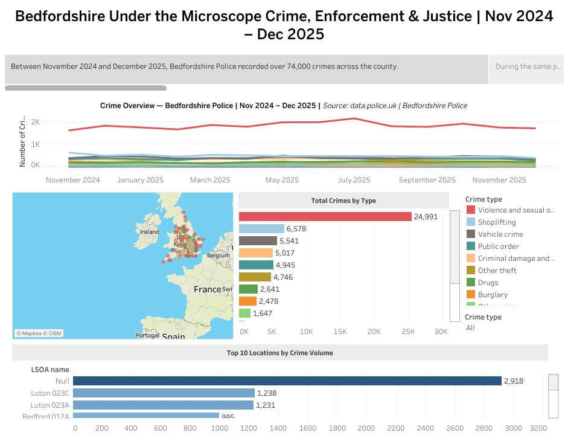

# Bedfordshire Under the Microscope
### Crime, Enforcement & Justice | Nov 2024 – Dec 2025

## 🔗 View the Live Dashboard
[Bedfordshire Under the Microscope — Tableau Public]
(https://public.tableau.com/views/Bedfordshire-Crime-Analysis-2024-2025/Story1?:language=en-GB&:sid=&:redirect=auth&:display_count=n&:origin=viz_share_link)
---

## 📋 Project Overview
An end-to-end data analysis project using real open-source 
policing data from Bedfordshire Police. The project explores 
three interconnected questions:

- Where is crime concentrated across Bedfordshire, and is it 
  increasing or decreasing over time?
- How is stop and search being used, and are outcomes 
  consistent across demographic groups?
- How often do recorded crimes result in a meaningful 
  justice outcome?

---

## 🔍 Key Findings
- Over 74,000 crimes were recorded in Bedfordshire between 
  November 2024 and December 2025
- Only **9% of crimes** resulted in a charge, caution, or 
  local resolution — consistent with the national average 
  and reflective of wider resourcing pressures in UK policing
- The majority of stop and searches were conducted under 
  the Misuse of Drugs Act 1971, with a significant proportion 
  resulting in no further action
  

---

## 🛠️ Tools & Technologies
| Stage | Tool |
|---|---|
| Data cleaning & wrangling | Python, Pandas, NumPy |
| Database storage & querying | PostgreSQL, SQLAlchemy |
| Exploratory analysis | Jupyter Notebook |
| Visualisation & dashboard | Tableau Public |
| Version control | Git, GitHub |

---

## 📁 Project Structure
- `notebooks/` — Jupyter Notebook covering data cleaning, 
   transformation, and exploratory analysis
- `sql/` — SQL schema and analysis queries used to interrogate 
   the PostgreSQL database
- `data/` — Data source information (raw files not included, 
   see data/README.md for download instructions)
- `images/` — Dashboard preview screenshots

---

## ⚠️ Analytical Decisions & Caveats
**Resolved crimes definition:** A crime is classified as 
resolved where either the Outcome type or Last outcome 
category field confirms a charge, caution, or local 
resolution. Ambiguous outcomes (awaiting court outcome, 
under investigation, court result unavailable) are excluded 
as their final status is unknown. This produces a 
conservative resolution rate.

**Null values:** A number of records contain null values 
across location, demographic, and outcome fields. These are 
common in open police data and reflect real-world recording 
limitations rather than data processing errors. Nulls are 
retained in the dataset and where relevant are acknowledged 
in the dashboard.

**Data source:** data.police.uk — open data published under 
the Open Government Licence v3.0.

---

Waqas 
